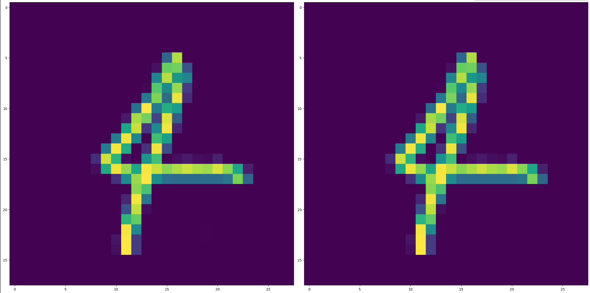
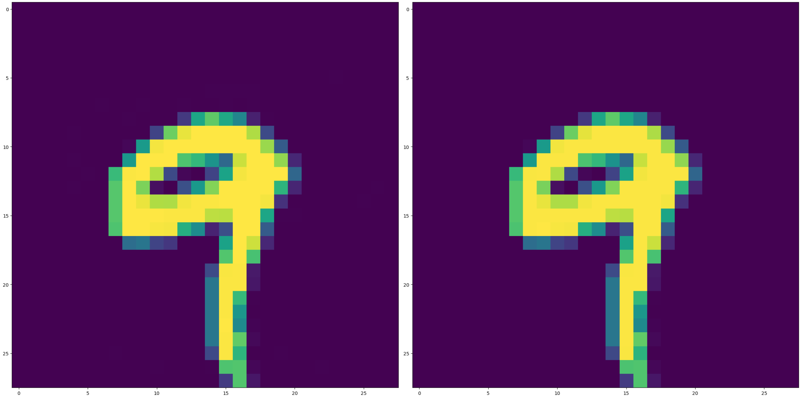

# DLFuzz implementation

DLFuzz is an adversarial input generator presented in this paper : https://arxiv.org/pdf/1808.09413

Adversarial inputs are generated for a DNN composed of 5 fully connected layers and trained on the MNIST dataset.

This model achieved 95% accuracy on the test dataset. 

With our implementation we generated 326 adversarial inputs out of 5000 images of the test set.

## Examples

***Left** is adversarial input recognised as 9, **right** is original input recognized as 4*

***Left** is adversarial input wrongly recognised as 8, **right** is original input recognized as 9*

## Next

Next step would be to generate adversarials inputs for a Convolutionnal Neural Network which could achieve much higher accuracy than the DNN used here.